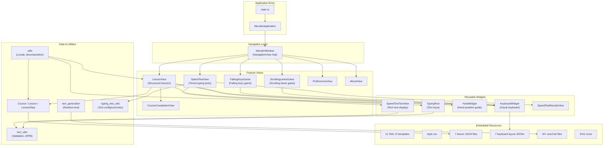
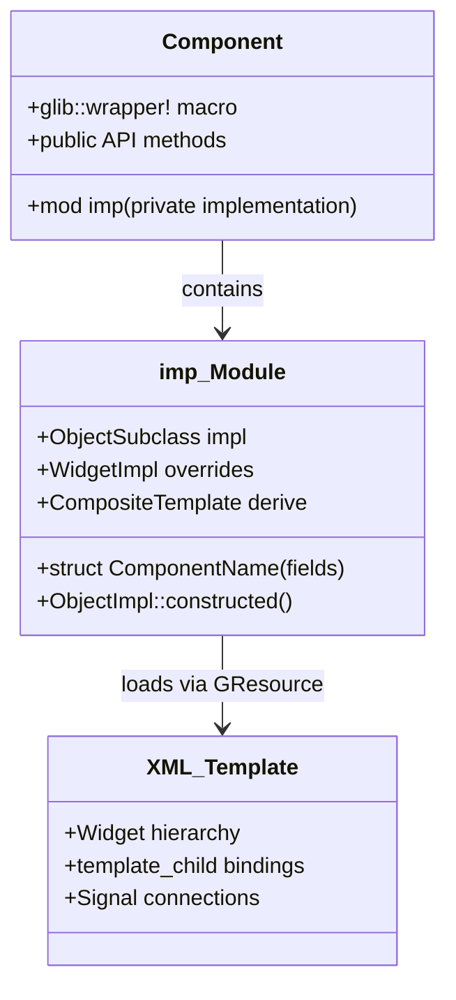
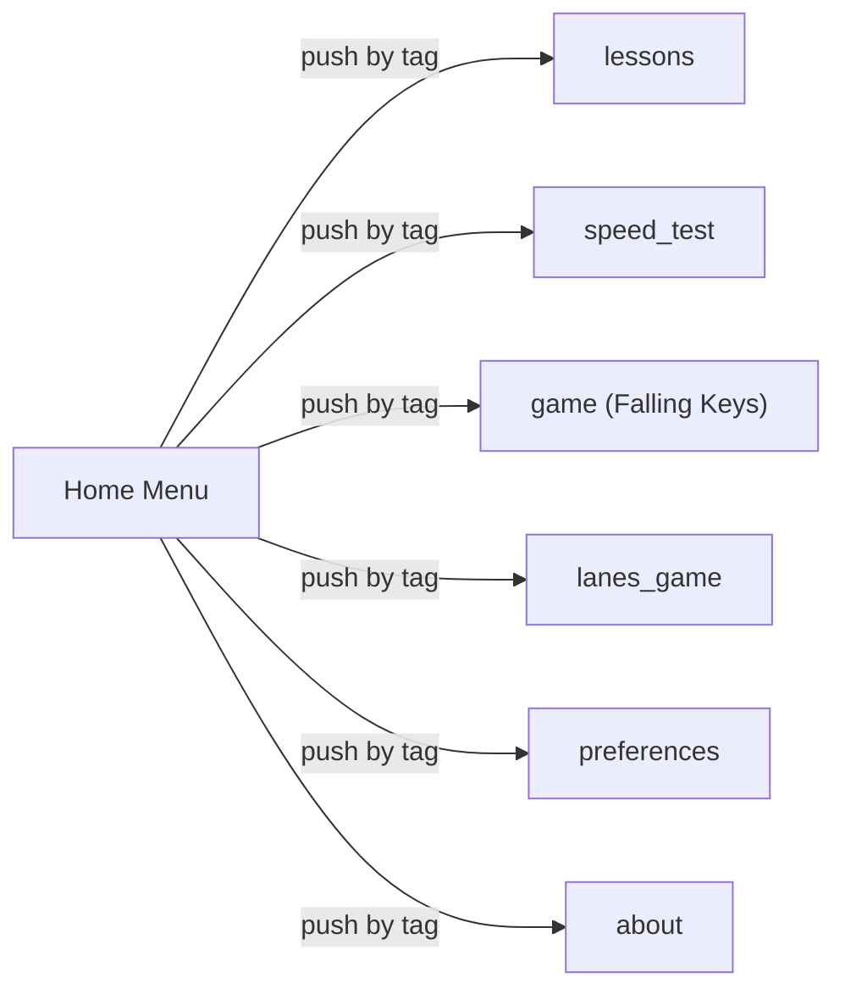

# Architecture
<!-- metadata: type=architecture, audience=ai-agents, scope=system-design -->

## Overview

Mecalin follows the standard GNOME application architecture using GTK4 with the Adwaita design system. It uses the GTK subclassing pattern where each UI component is a GObject subclass with a corresponding XML composite template.

## High-Level Architecture

## Design Patterns

### GTK4 Subclassing Pattern

Every UI component follows this structure:

Each component:
1. Defines a private `imp` module with the actual struct and trait implementations
2. Uses `#[derive(gtk::CompositeTemplate)]` to bind to an XML UI template
3. Exposes a public wrapper type via `glib::wrapper!`
4. Initializes in `ObjectImpl::constructed()` — setting up signals, loading data, binding settings

### Navigation Architecture

`MecalinWindow` uses `adw::NavigationView` as a stack-based navigation hub. Each feature is an `adw::NavigationPage` pushed by tag:

### State Management

- **GSettings** (`io.github.nacho.mecalin`): Persists user preferences (current lesson/step, widget visibility, finger colors, test duration)
- **Window state** (`io.github.nacho.mecalin.state.window`): Persists window size and maximized state
- **In-memory state**: Component-local `Cell`/`RefCell` fields in `imp` structs

### Resource Embedding

All UI templates, CSS, and icons are compiled into the binary via GResource (`resources.gresource.xml`). Lesson data, keyboard layouts, and word lists are embedded via `include_str!` and `include_dir!` macros at compile time.

### Build-Time Code Generation

`build.rs` performs two tasks:
1. **Config generation**: Processes `src/config.rs.in` template, replacing `@VARIABLE@` placeholders with environment variables (VERSION, APPLICATION_ID, GETTEXT_PACKAGE, DATADIR)
2. **Resource compilation**: Compiles `resources.gresource.xml` into a binary resource bundle

### Internationalization

- UI strings: gettext via `gettext-rs` and `i18n-format` crates
- Lesson content: Separate JSON files per language, selected by locale detection (`utils::language_from_locale()`)
- Keyboard layouts: Separate JSON files per language
- Word lists: Separate text files per language, embedded at compile time
