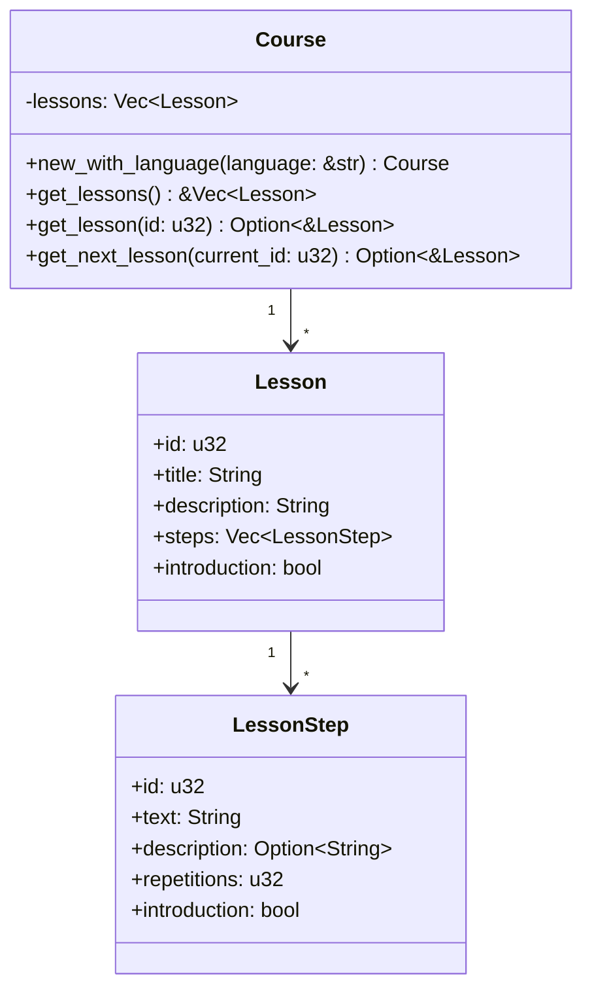
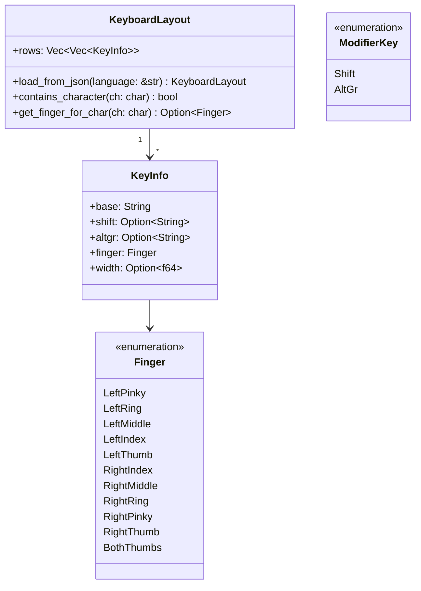
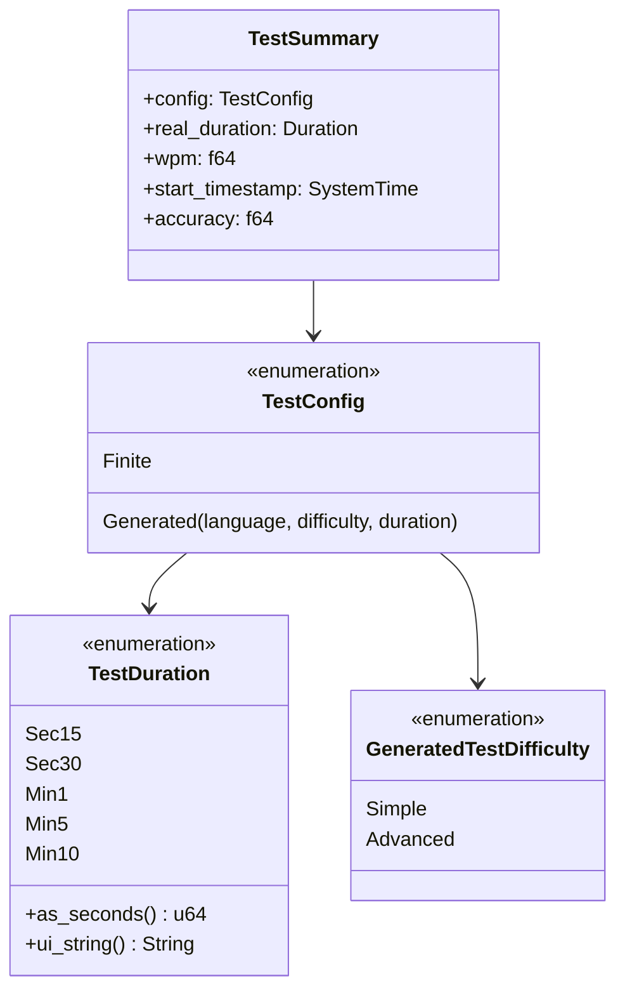
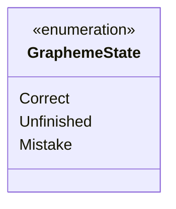
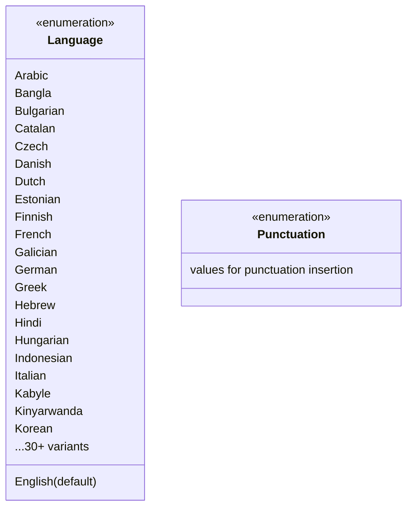

# Data Models
<!-- metadata: type=data-models, audience=ai-agents, scope=structs-enums-json -->

## Lesson Data Model



### Lesson JSON Structure

File location: `data/lessons/{language_code}.json`

```json
{
  "lessons": [
    {
      "id": 1,
      "title": "Home Row",
      "description": "Learn the home row keys",
      "introduction": false,
      "steps": [
        {
          "id": 1,
          "text": "fff jjj fff jjj",
          "description": "Practice f and j keys",
          "repetitions": 3,
          "introduction": false
        }
      ]
    }
  ]
}
```

## Keyboard Layout Data Model



### Keyboard Layout JSON Structure

File location: `data/keyboard_layouts/{language_code}.json`

```json
[
  [
    {"base": "`", "shift": "~", "finger": "left_pinky"},
    {"base": "1", "shift": "!", "finger": "left_pinky"},
    {"base": "q", "shift": "Q", "finger": "left_pinky", "altgr": "ä"}
  ]
]
```

## Speed Test Data Models



## Text Validation Model



`validate_with_replacements()` returns `Vec<(GraphemeState, line_num, start_byte, end_byte)>` — each tuple maps a grapheme's validation state to its exact position in the displayed text buffer.

## Text Generation Model



Word lists are embedded at compile time from `data/word_lists/{lang_code}.txt` via `include_dir!`. The `Language` enum maps to file names using `strum` derive macros (`to_string` attribute).

## GSettings State

Persisted user state (not a Rust struct, but a runtime data model):

| Schema | Key | Type | Purpose |
|--------|-----|------|---------|
| `io.github.nacho.mecalin` | `current-lesson` | u32 | Lesson progress |
| `io.github.nacho.mecalin` | `current-step` | u32 | Step progress |
| `io.github.nacho.mecalin` | `show-hand-widget` | bool | Preference |
| `io.github.nacho.mecalin` | `show-keyboard-widget` | bool | Preference |
| `io.github.nacho.mecalin` | `use-finger-colors` | bool | Preference |
| `io.github.nacho.mecalin` | `speed-test-duration` | u32 | Preference |
| `io.github.nacho.mecalin.state.window` | `maximized` | bool | Window state |
| `io.github.nacho.mecalin.state.window` | `size` | (i32, i32) | Window state |
