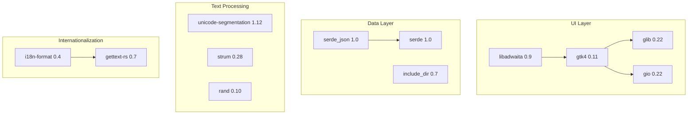

# Dependencies
<!-- metadata: type=dependencies, audience=ai-agents, scope=crates-system-deps -->

## Rust Crate Dependencies

### Core UI

| Crate | Version | Purpose |
|-------|---------|---------|
| `gtk4` (as `gtk`) | 0.11, feature `v4_14` | GTK4 Rust bindings — all UI widgets |
| `libadwaita` | 0.9, feature `v1_5` | Adwaita design system — NavigationView, ActionRow, SwitchRow, etc. |
| `gio` | 0.22 | GIO bindings — Settings, Actions, Resources |
| `glib` | 0.22, feature `log_macros` | GLib bindings — Object system, signals, main loop, timeout |

### Serialization

| Crate | Version | Purpose |
|-------|---------|---------|
| `serde` | 1.0, feature `derive` | Serialization framework — `Deserialize`/`Serialize` derives for lesson/keyboard data |
| `serde_json` | 1.0 | JSON parsing — lesson files, keyboard layout files |

### Internationalization

| Crate | Version | Purpose |
|-------|---------|---------|
| `gettext-rs` | 0.7, feature `gettext-system` | gettext bindings — UI string translation |
| `i18n-format` | 0.4 | Format macro for translatable strings with arguments |

### Text Processing

| Crate | Version | Purpose |
|-------|---------|---------|
| `unicode-segmentation` | 1.12 | Grapheme cluster iteration — correct character-by-character validation |
| `strum` | 0.28 | Enum utilities — string conversion for `Language`, `TestDuration`, etc. |
| `strum_macros` | 0.28 | Derive macros for strum — `EnumString`, `EnumDisplay`, `EnumIter`, `EnumMessage` |

### Other

| Crate | Version | Purpose |
|-------|---------|---------|
| `rand` | 0.10 | Random number generation — word selection, punctuation insertion |
| `anyhow` | 1.0 | Error handling — application startup error chain |
| `include_dir` | 0.7 | Embed directory contents at compile time — word list files |

## Build Dependencies

| Crate | Version | Purpose |
|-------|---------|---------|
| `glib-build-tools` | 0.22 | Compile GResource XML into binary resource bundle |
| `regex` | 1.11 | Template variable replacement in `config.rs.in` → `config.rs` |

## System Dependencies

| Library | Version | Required For |
|---------|---------|-------------|
| GTK4 (`libgtk-4-dev`) | ≥ 4.10 | UI framework |
| libadwaita (`libadwaita-1-dev`) | ≥ 1.5 | Adwaita design system |
| Meson | ≥ 0.59.0 | Production build system |
| Ninja | — | Meson backend |
| gettext | — | i18n message compilation |
| desktop-file-utils | — | Desktop file validation |

## Flatpak Runtime

| Component | Value |
|-----------|-------|
| Runtime | `org.gnome.Platform` 46 |
| SDK | `org.gnome.Sdk` 46 |
| SDK Extension | `org.freedesktop.Sdk.Extension.rust-stable` |

## Dependency Relationships

