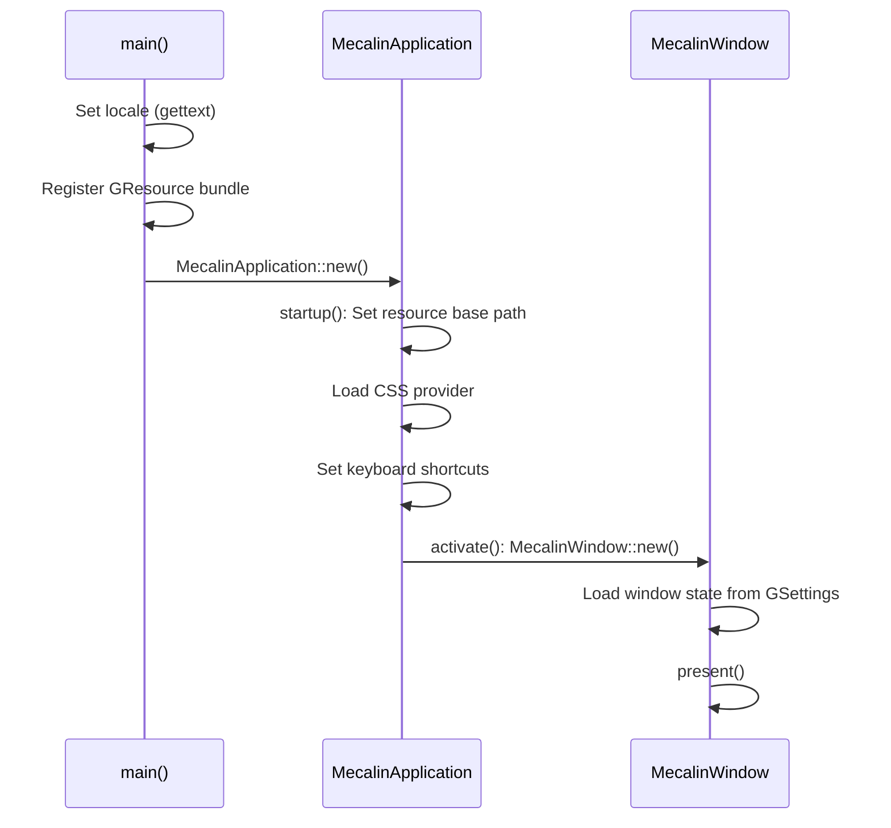
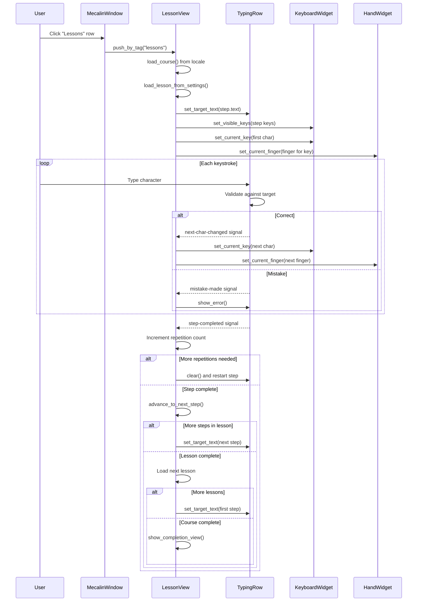
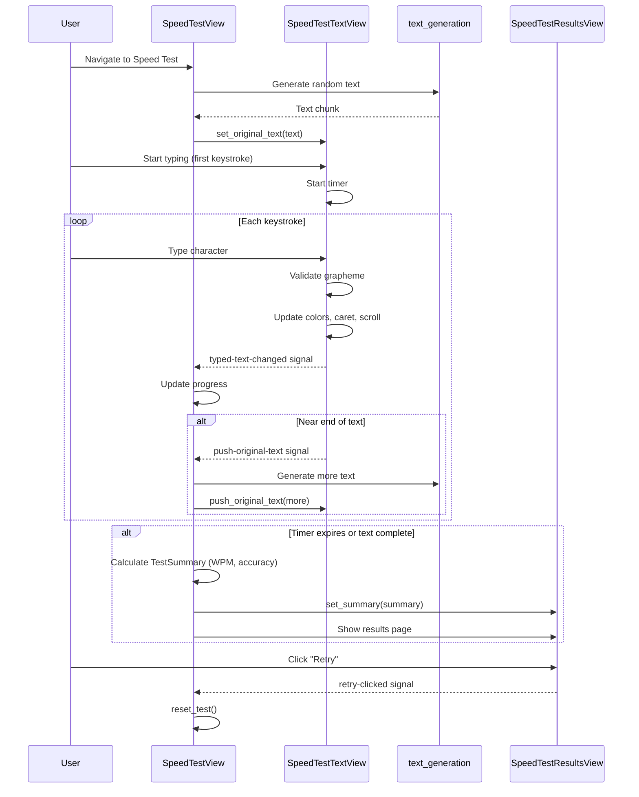
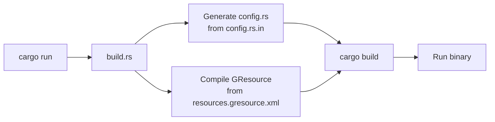
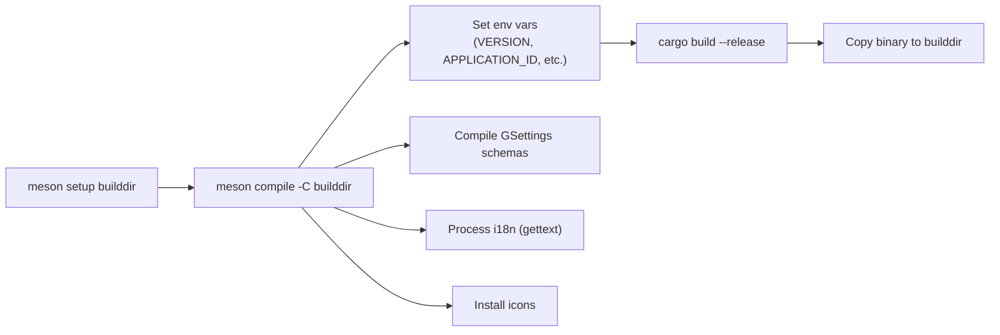
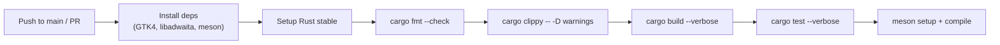

# Workflows
<!-- metadata: type=workflows, audience=ai-agents, scope=user-flows-build-processes -->

## Application Startup



## Lesson Flow



## Speed Test Flow



## Game Flow (Falling Keys / Scrolling Lanes)

```mermaid
sequenceDiagram
    participant user as User
    participant game as FallingKeysGame / ScrollingLanesGame
    participant keyboard as KeyboardWidget
    participant loop as Game Loop (glib::timeout)

    user->>game: Navigate to game
    game->>game: setup_game()
    game->>game: start_game_loop()

    loop Every frame (~16ms)
        loop->>game: update_game()
        game->>game: Move existing items
        game->>game: Check for missed items
        alt Spawn interval reached
            game->>game: spawn_key() / spawn_text()
        end
        game->>game: queue_draw()
    end

    user->>game: Press key
    game->>game: handle_key_press()
    alt Key matches falling item
        game->>game: Remove item, increment score
        game->>keyboard: Update highlight
    else No match
        game->>game: Decrement lives
    end

    alt Lives reach 0
        game->>game: show_game_over()
        user->>game: Click restart
        game->>game: restart_game()
    end
```

## Build Workflows

### Development Build (Cargo)



### Production Build (Meson)



## CI Pipeline



## Adding a New Language

1. Add language code to `po/LINGUAS`
2. Create/update `.po` file in `po/`
3. Create lesson file: `data/lessons/{lang_code}.json`
4. Create keyboard layout: `data/keyboard_layouts/{lang_code}.json`
5. Add `include_str!` match arm in `Course::new_with_language()`
6. Add locale match in `utils::language_from_locale()`
7. Optionally add word list: `data/word_lists/{lang_code}.txt`

## Release Process

1. Update version in `Cargo.toml` and `meson.build`
2. Add release entry in `data/io.github.nacho.mecalin.metainfo.xml`
3. Run `cargo fmt` and `cargo update -p mecalin`
4. Commit as "Release X.Y.Z"
5. Tag `vX.Y.Z`
6. Push changes and tags
